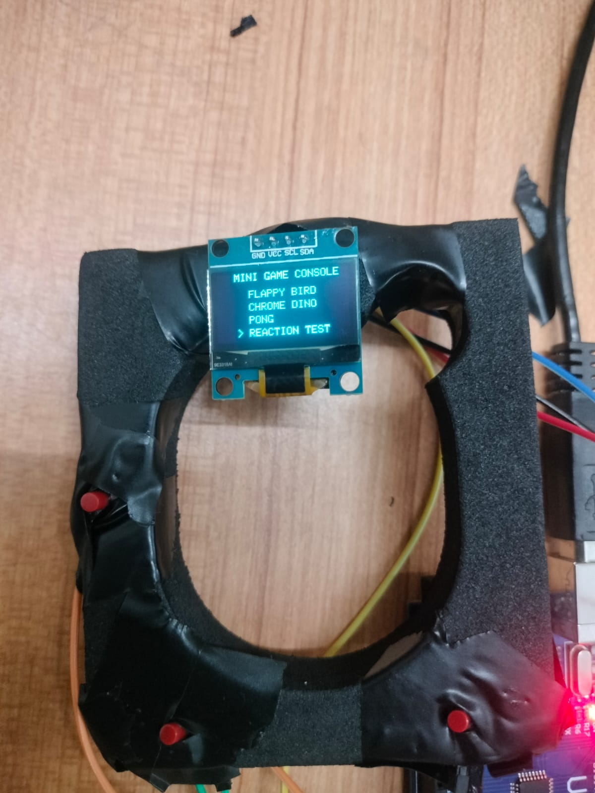
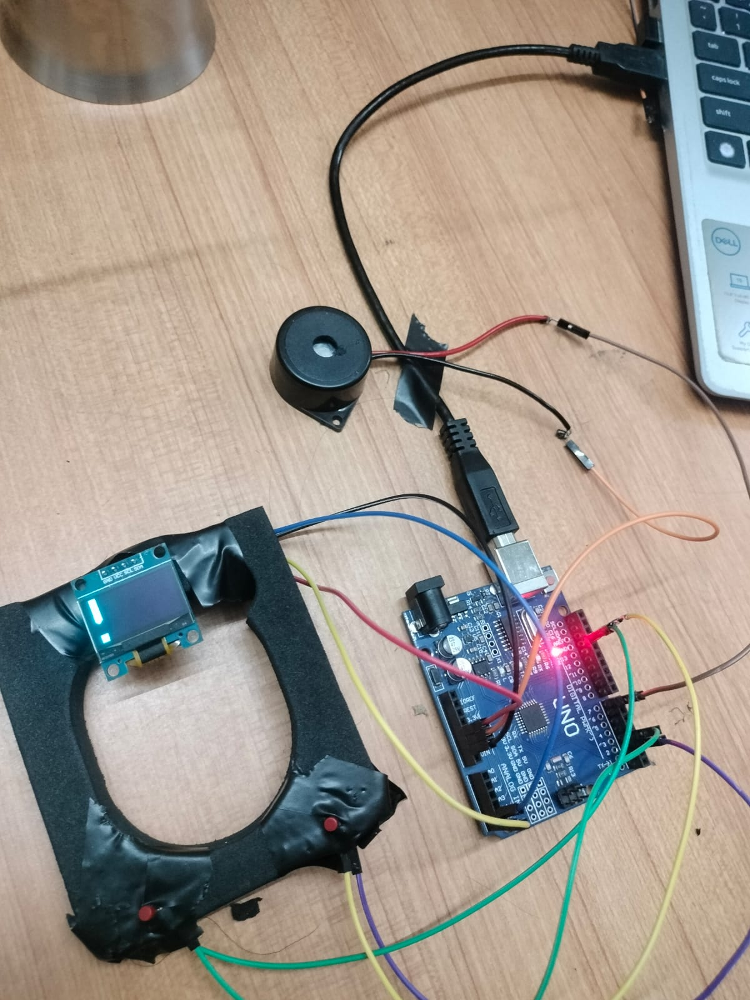

# Arduino Retro Game Console

An Arduino based handheld gaming console featuring four classic games, Flappy Bird, Chrome Dino, Pong and a Reaction Test, all displayed on a small OLED screen with buzzer sound effects.

This project was built using a basic Arduino Uno, an SSD1306 OLED display and three push buttons, everything housed in a compact handheld frame.

## Overview

The console runs a simple menu system on the OLED display. Using just three buttons, you can navigate between games, play them, and return to the main menu after each round. Sound effects are added through a buzzer to make the experience feel more complete, with different tones for menu navigation, scoring, and game over.

## Features

Multiple Built in Games
The console includes four playable games in a single build.
Flappy Bird
Chrome Dino
Pong Pro
Reaction Test

Sound Effects
Every action on the console has an associated sound.
Menu navigation sounds
Game score sounds
Game over effects
Dino defeat sound

OLED Interface
The display handles all visual feedback for the console.
Interactive game menu
Real time score display
Game over screen
Reaction timer display

Controls
The console is operated using three buttons only.
D2, Up, Jump, Start
D3, Down
D4, Select, Back to Menu

## Circuit Connections

| Component      | Arduino Pin |
|-----------------|-------------|
| Button Up       | D2          |
| Button Down     | D3          |
| Button Select   | D4          |
| Buzzer          | D7          |
| OLED SDA        | A4          |
| OLED SCL        | A5          |

## Libraries Used

Adafruit GFX
Adafruit SSD1306
Wire

These libraries can be installed directly through the Arduino IDE Library Manager.

## How It Works

The Arduino continuously reads input from the three buttons and updates the OLED display accordingly. When the console starts, the main menu appears showing all four games. Pressing the up and down buttons moves the selection cursor, and pressing select starts the highlighted game. Each game runs its own logic loop, drawing frames to the OLED and playing sounds through the buzzer for events like scoring points or losing the game. Pressing select again during gameplay returns the player to the main menu.

## Project Build

The console frame houses the OLED screen and the three push buttons, connected back to the Arduino board along with the buzzer for audio feedback.

## Demo

This project is a handheld Arduino based gaming console featuring four classic games with OLED graphics and buzzer sound effects, built as a fun and compact way to explore embedded systems, game logic, and hardware interfacing on a microcontroller.

## Getting Started

1. Wire the components according to the circuit connections table above.
2. Install the required libraries listed above through the Arduino IDE.
3. Upload the sketch to your Arduino board.
4. Power on the console and use the buttons to navigate the menu and play the games.

## Future Improvements

Adding more games to the menu
Adding a battery pack for portable use
Improe graphics in all games

## 📜 License

This project is licensed under the **MIT License**. See the [LICENSE](LICENSE) file for more information. 0

## 👨‍💻 Creator

- **Xyraa Kyys**
  - GitHub: https://github.com/Xyraakyzzz
